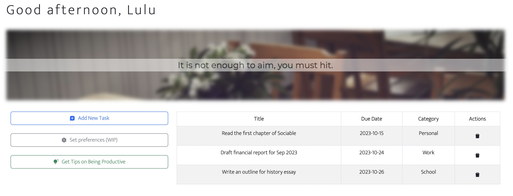

## Typescript + Vite + React To-do app

Preview

### Functionalities

- Enter task title to list
- Retrieve task list
- Update task title
- Delete task from list
- Store task list on browser

### How to use

1. Input task title to 'Todo item title' input field
2. Press 'Add' or hit Enter
3. View task list on the right
4. Delete task by pressing 'Remove'
5. Update task by pressing 'Update' and modify title, press 'Cancel' to abort

### Attribution

<a href="https://www.flaticon.com/free-icons/remove" title="remove icons">Remove icons created by alkhalifi design -
Flaticon</a>